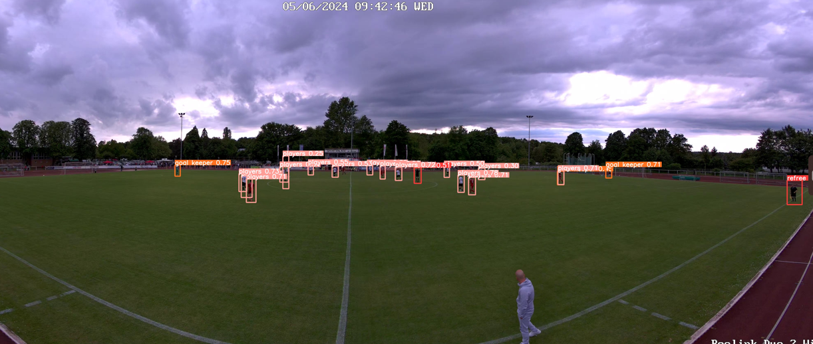
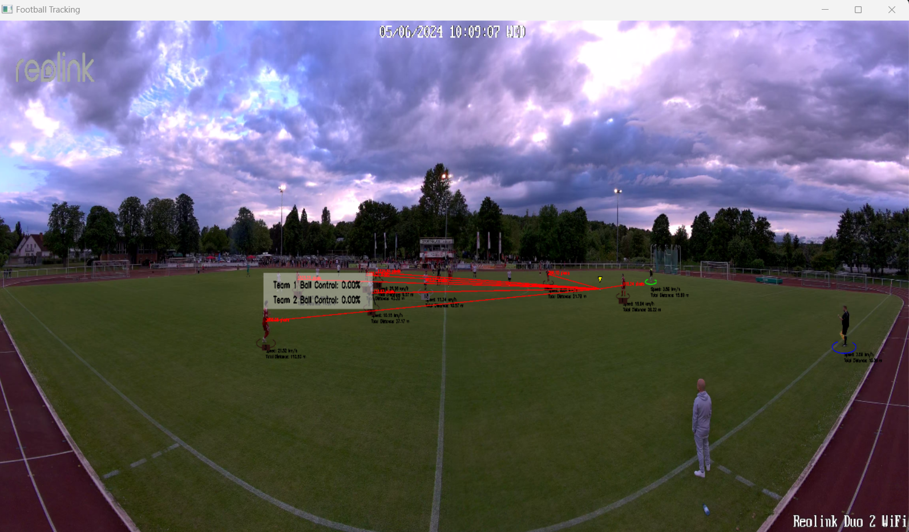

# Football-Tracking-and-Analysis-Using-YOLOv8
This project focuses on developing an advanced football tracking and analysis system using YOLOv8.
The system detects key elements in football games, such as players, referees, goalkeepers, and the ball. Key features include player tracking, team color assignment, ball possession analysis, and speed/distance estimation. Despite challenges like inconsistent track IDs and camera movement, custom solutions were implemented to improve tracking stability and accuracy. The system offers comprehensive insights into player movements and game dynamics for detailed sports analysis.

## Results

  
  

